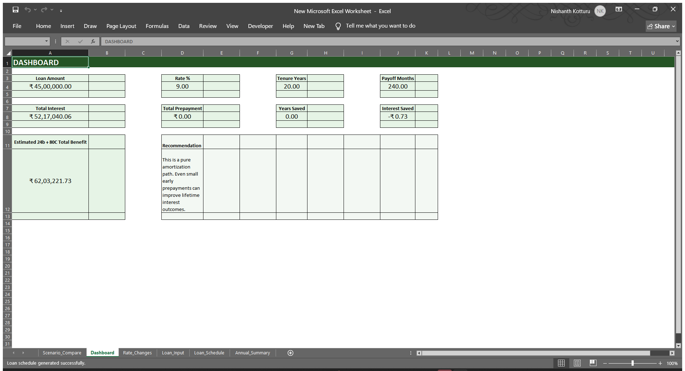
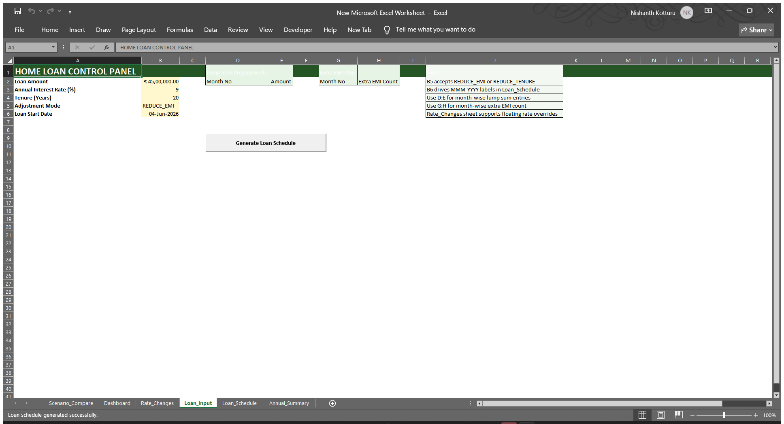
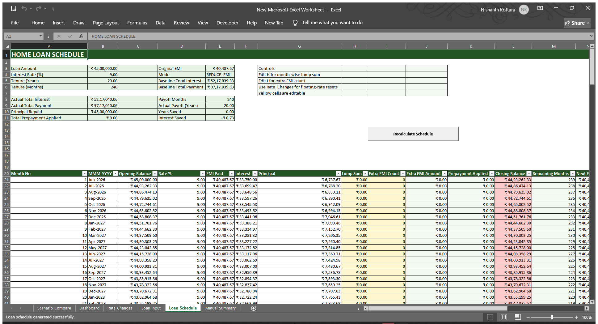
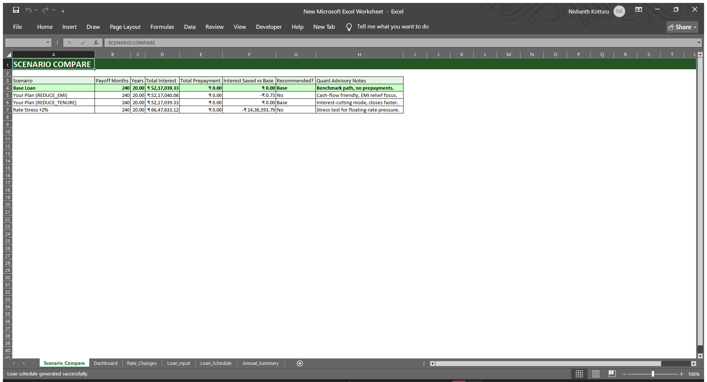
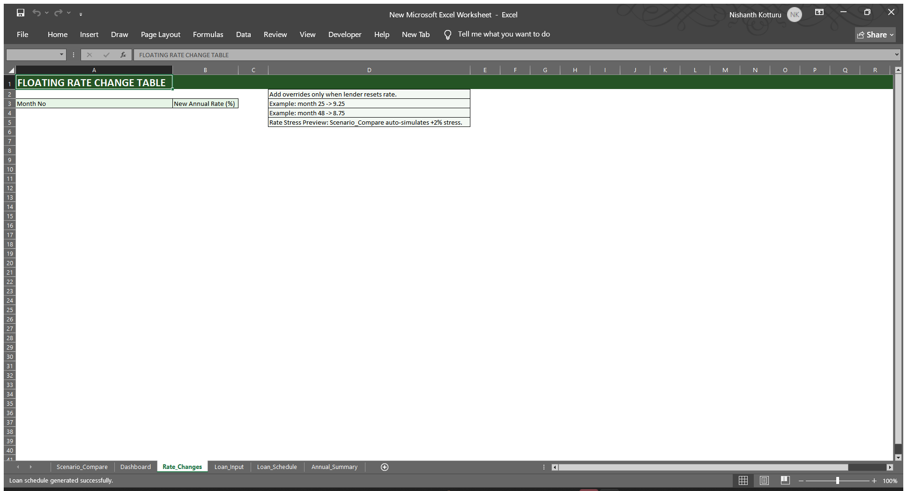
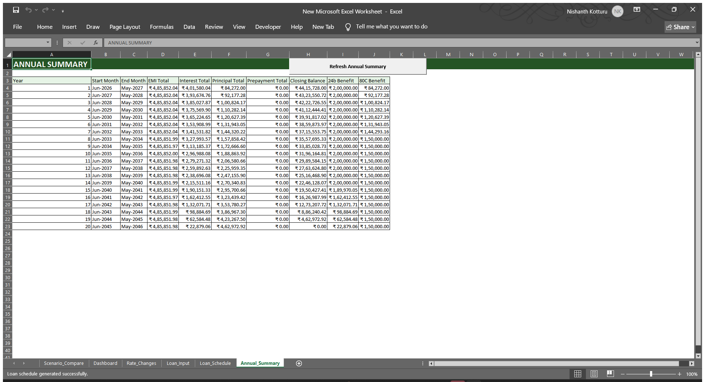

  
  
  
  
  
  

# 🏠 Home Loan Strategy Lab

*Simulate, stress-test, and compare your Indian home loan — entirely inside Excel.*

## Table of contents

| Section | Link |
| --- | --- |
| What this does | [What this does](#what-this-does) |
| Screenshots | [Screenshots](#screenshots) |
| Features | [Features](#features) |
| How it works | [How it works](#how-it-works) |
| Getting started | [Getting started](#getting-started) |
| Sheet guide | [Sheet guide](#sheet-guide) |
| Prepayment modes | [Prepayment modes](#prepayment-modes) |
| Tax benefits tracked | [Tax benefits tracked](#tax-benefits-tracked) |
| Scenario compare — what gets simulated | [Scenario compare — what gets simulated](#scenario-compare--what-gets-simulated) |
| FAQ | [FAQ](#faq) |
| Contributing | [Contributing](#contributing) |
| License | [License](#license) |

## What this does

It estimates your month-by-month home loan journey inside Excel.  
It updates EMI, tenure, tax benefit, and balance after your prepayments.  
It compares normal, planned, and stressed loan paths before you commit.  

## Screenshots

### Loan_Input

*This sheet captures your loan inputs and prepayment plan.*  

### Loan_Schedule

*This sheet shows the full amortization schedule and editable prepayment columns.*  

### Dashboard

*This sheet shows headline loan numbers and a quick recommendation.*  

### Scenario_Compare

*This sheet compares four loan strategies on interest, payoff, and prepayment.*  

### Rate_Changes

*This sheet stores month-wise floating rate changes for the simulation.*  

### Annual_Summary

*This sheet rolls monthly output into a year-by-year summary.*  

## Features

| Feature | What it does |
| --- | --- |
| Tool | Uses a Microsoft Excel macro-enabled workbook (`.xlsm`). |
| Language | Uses VBA in a single `LoanModule.bas` file. |
| Purpose | Simulates Indian home loan cash flow and prepayment choices. |
| Sheets | Includes `Loan_Input`, `Loan_Schedule`, `Rate_Changes`, `Dashboard`, `Scenario_Compare`, and `Annual_Summary`. |
| Inputs | Reads loan amount, annual interest rate, tenure years, start date, and prepayment mode. |
| Prepayment modes | Supports `REDUCE_EMI` and `REDUCE_TENURE`. |
| Lump sum support | Accepts month-wise lump sum prepayments. |
| Extra EMI support | Accepts month-wise extra EMI counts. |
| Floating rate support | Applies month-wise rate changes from `Rate_Changes`. |
| Tax tracking | Tracks Section 24(b) up to ₹2,00,000 and Section 80C up to ₹1,50,000. |
| Comparison engine | Runs Base Loan, Your Plan EMI, Your Plan Tenure, and Rate Stress +2%. |
| Dashboard | Shows Loan Amount, Rate %, Tenure, Payoff Months, Total Interest, Total Prepayment, Years Saved, and Interest Saved. |
| Chart | Draws an Interest vs Principal line chart by month. |
| Number format | Uses Indian lakh and crore style with the ₹ symbol. |
| Month labels | Uses `MMM-YYYY` labels from the loan start date. |
| Buttons | Includes Generate Loan Schedule, Recalculate Schedule, and Refresh Annual Summary. |
| Compatibility | Works on Excel 2016 and later on Windows. |

## How it works

1. Setup: Run the setup macro once to build the workbook structure.  
2. Fill inputs: Enter loan details, start date, and any prepayment plan.  
3. Generate: Run the schedule macro to compute sheets, chart, taxes, and comparisons.  

## Getting started

### Prerequisites

| Requirement | Details |
| --- | --- |
| Operating system | Windows |
| Excel version | Excel 2016 or later |
| Macro setting | Macros must be enabled |

### Installation

1. Download HomeLoanStrategyLab.xlsm from the Releases tab.
2. Open in Excel. Click Enable Macros when prompted.
3. Go to Developer tab → Macros → run SetupLoanCalculator once.
4. Fill your loan details in Loan_Input sheet.
5. Click Generate Loan Schedule.

## Sheet guide

### Loan_Input

`Loan_Input` is the control panel. Enter your loan amount, rate, tenure, start date, mode, and seed prepayments here.

### Loan_Schedule

`Loan_Schedule` shows every loan month in order. You can edit lump sum and extra EMI cells, then recalculate.

### Rate_Changes

`Rate_Changes` stores future floating rate overrides. Enter the month number and new annual rate.

### Dashboard

`Dashboard` shows the headline view. It summarizes payoff, savings, and estimated tax benefit.

### Scenario_Compare

`Scenario_Compare` shows four tested paths side by side. It helps you compare cash flow relief and interest savings.

### Annual_Summary

`Annual_Summary` groups monthly results into loan years. It helps you review yearly EMI, interest, tax benefit, and balance.

## Prepayment modes

| Mode | What changes | Best for |
| --- | --- | --- |
| REDUCE_EMI | Future EMI falls after prepayment. | Lower monthly burden |
| REDUCE_TENURE | EMI stays steady and payoff shortens. | Faster loan closure |

## Tax benefits tracked

| Section | Annual cap | How it is computed | Where to see it in the tool |
| --- | --- | --- | --- |
| Section 24(b) | ₹2,00,000 | Eligible monthly interest is capped across each loan year. | `Loan_Schedule` column P and yearly summaries |
| Section 80C | ₹1,50,000 | Eligible monthly principal is capped across each loan year. | `Loan_Schedule` column Q and yearly summaries |

## Scenario compare — what gets simulated

| Scenario | Prepayments used | Mode | What it tests |
| --- | --- | --- | --- |
| Base Loan | None | REDUCE_TENURE | Baseline path without prepayment |
| Your Plan EMI | Your lump sum and extra EMI plan | REDUCE_EMI | EMI reduction after prepayment |
| Your Plan Tenure | Your lump sum and extra EMI plan | REDUCE_TENURE | Faster closure with the same plan |
| Rate Stress +2% | Your lump sum and extra EMI plan | REDUCE_TENURE | Impact of a higher floating rate path |

## FAQ

Do I need to install anything beyond Excel?

No. It runs as a native Excel VBA workbook.

Does this work on Mac?

No. The documented compatibility is Excel 2016 and later on Windows.

Can I use this for a loan that has already started?

Yes. Enter your loan start date and current planning assumptions.

What happens when my bank changes my floating rate?

Add the month and new annual rate in `Rate_Changes`.

Is my data sent to any server?

No server feature is described. It is a local Excel VBA workbook.

## Contributing

Pull requests are welcome.  
All business logic lives in `LoanModule.bas`, so it is easy to review and fork.  

## License

MIT
